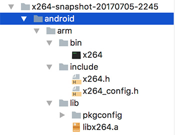

# 编译FFmpeg

### 解压需要的库
1. 解压`ffmpeg`到`ffmpeg-build`；  
2. 解压`fdk_aac`到`ffmpeg`；
3. 解压`libx264`到`ffmpeg `；  

解压后的目录结构应该是这样  

  

### 复制脚本文件  
复制`ffmpeg-build`里的脚本文件到对应文件夹：  

* 将`build_fdk_aac.sh`复制到`fdk_aac`文件夹  
* 将`build_libx264.sh`复制到`libx264`文件夹   
* 将`build_config.sh`复制到`ffmpeg`文件夹  
* 将`build_ffmpeg.sh`复制到`ffmpeg`文件夹  

进入到FFmpeg文件夹

```
cd ffmpeg-native/ffmpeg-build/ffmpeg-3.2.9
```

赋予整个文件夹权限

```
chmod -R +x *
```


### 编译fdk_aac
如果没有初始化过需要先初始化

```
cd fdk-aac-0.1.6
./configure
make
make install
```
初始化成功后执行编译脚本

```
./build_fdk_aac.sh
```
编译成功后会生成`android`文件夹，包含需要的产物


回到FFmpeg文件夹

```
cd ..
```

### 编译libx264
如果没有初始化过需要先初始化

```
cd x264-snapshot-20170705-2245
./configure
make
make install
```

初始化成功后执行编译脚本

```
./build_libx264.sh
```
编译成功后会生成`android`文件夹，包含需要的产物



回到FFmpeg文件夹

```
cd ..
```

### 编译FFmpeg
如果没有初始化过需要先初始化

```
./configure --disable-yasm --enable-libx264 --enable-gpl
make
make install
```

初始化成功后执行编译脚本

```
build_ffmpeg.sh
```
编译成功后会生成`android`文件夹，包含需要的产物

